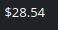

# Claude Code Cost Widget

A KDE Plasma 6 widget that shows the cost of **today's Claude Code usage** right in your panel, calculated from real token pricing. It refreshes once a minute, so you always have a live figure for what the day has cost so far.



## What it does

The widget runs a usage-reporting command on a timer, reads the JSON it produces, finds the most recent day in the report, and displays that day's total cost (e.g. `$28.54`). Click the number any time to force an immediate refresh instead of waiting for the next minute.

- Lives in the panel as a compact `$X.XX` figure
- Updates automatically every 60 seconds
- Click to refresh on demand
- Turns red if the last run failed, so you notice when something's off

## Requirements

- **KDE Plasma 6** (this uses the Plasma 6 / KF6 widget API and will not work on Plasma 5)
- **Node.js / npx**, since the cost data comes from an npm-based usage tool
- A command-line tool that reports Claude Code usage as JSON. This widget expects the shape produced by tools like [`ccusage`](https://www.npmjs.com/package/ccusage) — a top-level `daily` array where each entry has a `period` (`YYYY-MM-DD`) and a `totalCost`.

## Installation

Clone the repo and install the package with `kpackagetool6`:

```bash
git clone https://github.com/johanneszelger/claude-cost-plasma6-widget.git
cd claude-cost-plasma6-widget
kpackagetool6 --type Plasma/Applet --install .
```

Then right-click your panel → **Add or Manage Widgets…** → search for **Claude Code Cost** → drag it onto the panel.

To update after pulling new changes:

```bash
kpackagetool6 --type Plasma/Applet --upgrade .
```

If a running instance doesn't pick up the change, restart the shell:

```bash
plasmashell --replace &
```

## Configuration

The command and refresh interval are set at the top of `contents/ui/main.qml`:

```qml
readonly property string command:
    "bash -lc 'npx --yes your-usage-tool --json 2>/dev/null'"

readonly property int intervalMs: 60 * 1000   // once a minute
```

Point `command` at whatever produces your usage JSON. It's wrapped in `bash -lc` so your login shell's `PATH` is loaded — without that, the panel often can't find `npx`. If it still can't, use the absolute path to `npx` (find it with `which npx`).

After editing, run the `--upgrade` command above to apply the change.

## How it works

1. A QML `Timer` fires every minute (and once immediately on load).
2. Each tick runs the configured command through Plasma's `executable` data engine (`Plasma5Support.DataSource`).
3. When the command finishes, the widget parses the JSON, scans the `daily` array for the entry with the latest `period`, and reads its `totalCost`.
4. The value is formatted as currency and shown in the panel. Comparing `period` strings (rather than trusting array order) keeps the right day selected even if the report is unordered.

## Troubleshooting

**The number shows `err`.** The command failed or didn't return valid JSON. Run the exact command from `main.qml` in a terminal to see the real output:

```bash
bash -lc 'npx --yes your-usage-tool --json 2>/dev/null'
```

**`command not found` for npx.** Your panel's environment doesn't have Node on its `PATH`. Either keep the `bash -lc` wrapper (it loads your login profile) or hardcode the absolute path to `npx`.

**Changes don't appear after editing.** Run `kpackagetool6 --type Plasma/Applet --upgrade .`, then restart with `plasmashell --replace &`.

**Testing without touching your real panel.** Install the `plasma-sdk` package and run `plasmoidviewer -a .` from the repo root (the folder containing `metadata.json`). Launch it from a terminal so QML errors and any `console.log` output are visible.

## Notes

The figure tracks the **current day's running total**, so it climbs throughout the day and resets when a new day begins. If you'd prefer a steadier number (yesterday's complete total, or a month-to-date sum), it's a small change to the parsing logic in `main.qml`.

## License

Released under the [MIT License](LICENSE).
